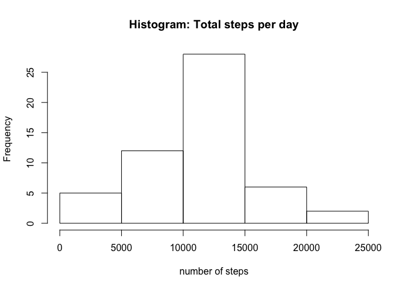
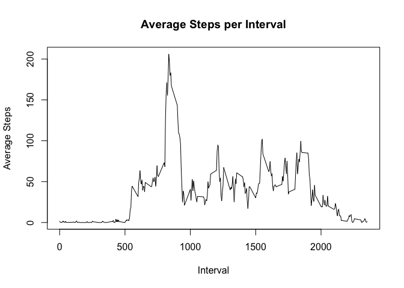
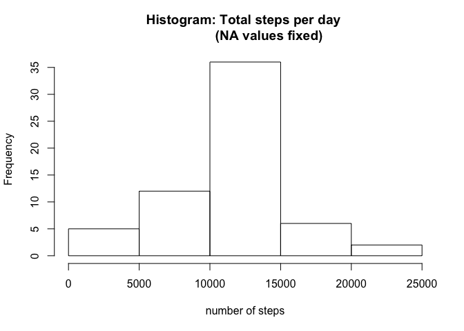
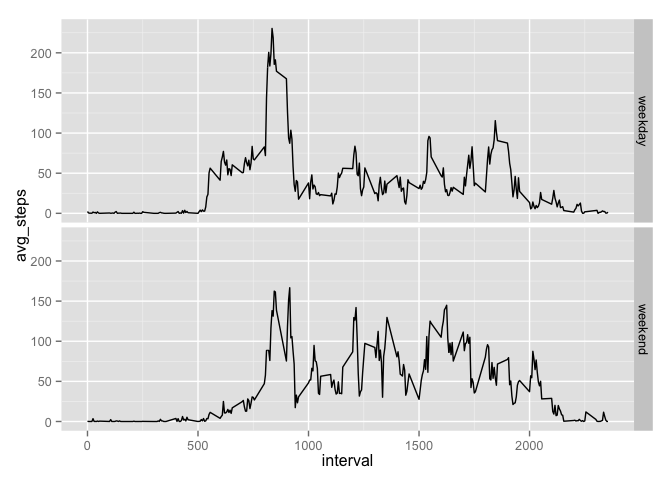

# Reproducible Research: Peer Assessment 1


## Loading and preprocessing the data
Using the 'dplyr' package to process the data, and ggplot2 to draw final plot.

```r
library(dplyr)
```

```
## 
## Attaching package: 'dplyr'
## 
## The following object is masked from 'package:stats':
## 
##     filter
## 
## The following objects are masked from 'package:base':
## 
##     intersect, setdiff, setequal, union
```

```r
library(ggplot2)
```

```
## Warning: package 'ggplot2' was built under R version 3.1.3
```

```r
data<-read.csv(file="activity.csv")
grouped_by_date<-group_by(data,date)
```


## What is mean total number of steps taken per day?
Here is a histogram showing the distribution of steps taken each day.

```r
#calculate total steps taken per day
        grouped_by_date<-group_by(data,date)
        steps_per_day<-summarise(grouped_by_date,totals=sum(steps))
        #histogram of steps taken each day
        hist(steps_per_day$totals, main="Histogram: Total steps per day", 
        xlab="number of steps")
```

 


```r
#calculate and report the mean and median of total steps per day
        mean_steps<-mean(steps_per_day$totals,na.rm=TRUE)
        median_steps<-median(steps_per_day$totals,na.rm=TRUE)
```
The mean total steps per day was 1.0766189\times 10^{4}.
The median total steps per day was 10765.

## What is the average daily activity pattern?
Here is a time series showing the evolution across the 5 minute intervals 
of average steps across all days:


```r
#time series plot (type=l) of 5-minute interval(xaxis) avg steps
                #average across all days (yaxis)
        grouped_by_interval<-group_by(data,interval)
        avg_per_interval<-summarise(grouped_by_interval,avg_steps=
                                            mean(steps,na.rm=TRUE))
        plot(x=avg_per_interval$interval,y=avg_per_interval$avg_steps,type='l',
             main="Average Steps per Interval", xlab="Interval", 
             ylab="Average Steps")
```

 


```r
#which 5 minute interval on avg across all days contains max steps
        max_steps<-filter(avg_per_interval,avg_per_interval$avg_steps==
                                  max(avg_per_interval$avg_steps))
```
The interval with highest average across all days was 835 and had
value of 206.1698113.


## Imputing missing values

```r
#calc and report total missing values (total rows with NA)
        count_na<-sum(is.na(data$steps))
```
There were 2304 'NA' values in the data. These were replaced with the
corresponding average value corresponding to that interval.

```r
#fill in missing - use mean for 5 min interval
        nas<-filter(data,is.na(data$steps)==TRUE)
        notnas<-filter(data,is.na(data$steps)==FALSE)
        isnafix<-merge(nas,avg_per_interval,by ='interval')
        isnafix$steps<-isnafix$avg_steps
        isnafix<-select(isnafix,steps,date,interval)
        fixed_data<-rbind(isnafix,notnas)
```
Here is a redrawn histogram with the overridden NA values:

```r
#make histogram of total steps taken each day and calc 
        fixed_by_date<-group_by(fixed_data,date)
        fix_steps_per_day<-summarise(fixed_by_date,totals=sum(steps))
        hist(fix_steps_per_day$totals,main="Histogram: Total steps per day 
             (NA values fixed)", xlab="number of steps")
```

 


```r
#report mean and median steps per day - differ from first calc? impact?
        fix_mean_steps<-mean(fix_steps_per_day$totals)
        fix_median_steps<-median(fix_steps_per_day$totals)
        unfix_total<-sum(steps_per_day$totals,na.rm=TRUE)
        fix_total<-sum(fix_steps_per_day$totals)
        impact_total_steps<-sum(fix_steps_per_day$totals)-
                sum(steps_per_day$totals,na.rm=TRUE)
```
With the NA values corrected, the new mean is 1.0766189\times 10^{4} compared to 
1.0766189\times 10^{4} and the new median is 1.0766189\times 10^{4} which compares to 
10765. Given that the replacement values were mean values, there is no change to the mean, and the median shifts a little closer to the mean. 

## Are there differences in activity patterns between weekdays and weekends?
Here is a comparative plot to show the difference in activity across intervals
based on whether activity took place on a weekday or weekend:

```r
#create new factor with two levels "weekday" "weekend"
        fixed_data$date<-as.Date(fixed_data$date)
        fixed_data$weekday<-factor(ifelse(weekdays(fixed_data$date) == 'Saturday' 
                | weekdays(fixed_data$date)=='Sunday',"weekend","weekday"))
        #group and summarise by interval and weekday/weekend
        grouped_by_intwkend<-group_by(fixed_data,interval,weekday)
        avg_weekday<-summarise(grouped_by_intwkend,avg_steps=mean(steps))
        #panel plot to compare the two
        week_plot<-ggplot(avg_weekday,aes(x=interval,y=avg_steps))+geom_line()+facet_grid(weekday~.)        
        print(week_plot)
```

 

